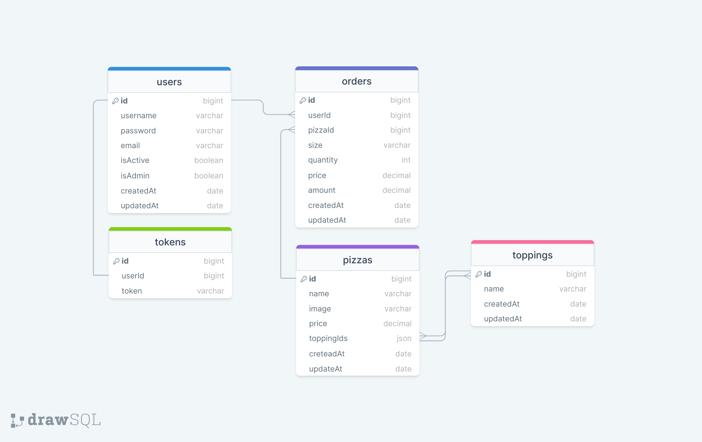

## Pizza Api
This is a RESTful API for managing pizza orders. It allows users to create accounts, order pizzas, and manage pizza toppings.

[Pizza Api Live Page]()
<br><br>
If you prefer to see Redoc or JSON instead of Swagger, simply replace 'swagger' in the endpoint with 'redoc' or 'json'.<br>
[Swagger Documents]()

## Project Skeleton


```
Pizza Api/ (folder)
  ├── index.js          
  ├── .env
  ├── public
  ├    ┣ static
  ├    ┣ index.html   
  ├── src
      ┣ configs
      ┃ ┗ dbConnection.js
      ┃ ┣ swagger.json
      ┣ controllers
      ┃ ┣ auth.js
      ┃ ┣ order.js
      ┃ ┣ pizza.js
      ┃ ┣ topping.js
      ┃ ┣ token.js
      ┃ ┗ user.js
      ┣ helpers
      ┃ ┣ sync.js
      ┃ ┣ sendMail.js
      ┃ ┗ paswordEncrypte.js
      ┣ middlewares
      ┃ ┣ authentication.js
      ┃ ┣ errorHandler.js
      ┃ ┣ logger.js
      ┃ ┣ permissions.js
      ┃ ┣ upload.js
      ┃ ┗ queryHandler.js
      ┣ models
      ┃ ┣ order.js
      ┃ ┣ pizza.js
      ┃ ┣ topping.js
      ┃ ┣ token.js
      ┃ ┗ user.js
      ┣ routes
      ┃ ┣ auth.js
      ┃ ┣ document.js
      ┃ ┣ index.js
      ┃ ┣ order.js
      ┃ ┣ pizza.js
      ┃ ┣ topping.js
      ┃ ┣ token.js
      ┃ ┗ user.js
      
  ├── swaggerAutogen.js
  ├── package.json   
  └── README.md       
```
## Tech/framework used
- **Express.js:** Fast and flexible Node.js web application framework.
- **MongoDB:** Flexible and scalable NoSQL database solution.
- **Mongoose:** Object Data Modeling (ODM) library for MongoDB.
- **Logging:** Logging functionality is integrated to track application activities and errors.
- **Swagger/Redoc:** Documentation is generated using Swagger or Redoc to provide API documentation in an interactive and user-friendly manner.
- **JSON File Creation:** JSON files are created to store data or configurations for various purposes.
- **Token-based Authentication:** Token-based authentication mechanism is implemented to ensure secure communication between client and server, enhancing overall application security and user authentication.
- **Dotenv:** Node.js module used for loading environment variables.
- **Express-async-errors:** Helper module for asynchronous error handling in Express applications.
- **CRUD Operations** Users can create, read, update, and delete books from the database.
- **Middleware** Middleware functions are implemented to handle requests, perform validations, and enhance security.

## Project ERD



## Getting Started

This is an example of how you may give instructions on setting up your project locally.
To get a local copy up and running follow these simple example steps.

### Prerequisites

This is an example of how to list things you need to use the software and how to install them.

- npm
  ```sh
  npm install npm@latest -g
  ```

### Installation

_Below is an example of how you can instruct your audience on installing and setting up your app. This template doesn't rely on any external dependencies or services._

1. Clone the repo
   ```sh
   git clone https://github.com/esmaaksoy/PizzaAPI
   ```
2. Install NPM packages
   ```sh
   npm install
   ```
3. Create .env file in home directory.
   ```sh
   PORT=8000
   MONGODB=ENTER YOUR Database adres or local: mongodb://127.0.0.1:27017/pizzaApi
   SECRET_KEY=ENTER YOUR random letters and number, for example: jsl78dd9ff6f6s9jkd89Kkfnfd
   ACCESS_KEY=ENTER YOUR random letters and number, for example: jsl78dd9ff6f6s9jkd89Kkfnfd
   REFRESH_KEY=ENTER YOUR random letters and number, for example: jsl78dd9ff6f6s9jkd89Kkfnfd
   PAGE_SIZE=25
   EMAIL=ENTER YOUR email adress
   EMAIL_PASS=ENTER YOUR password for sendMail

   ```
4. Logs File
   ```sh
   You can write:
   mkdir logs
   ```
5. The project is ready, you can start using it now.
   ```sh
   You can run:
   nodemon
   ```

### IMPORTANT NOTES ! 

To use the application, you can log in with the following email and password <br>
email: admin@site.com <br>
password: aA?123456 <br>
